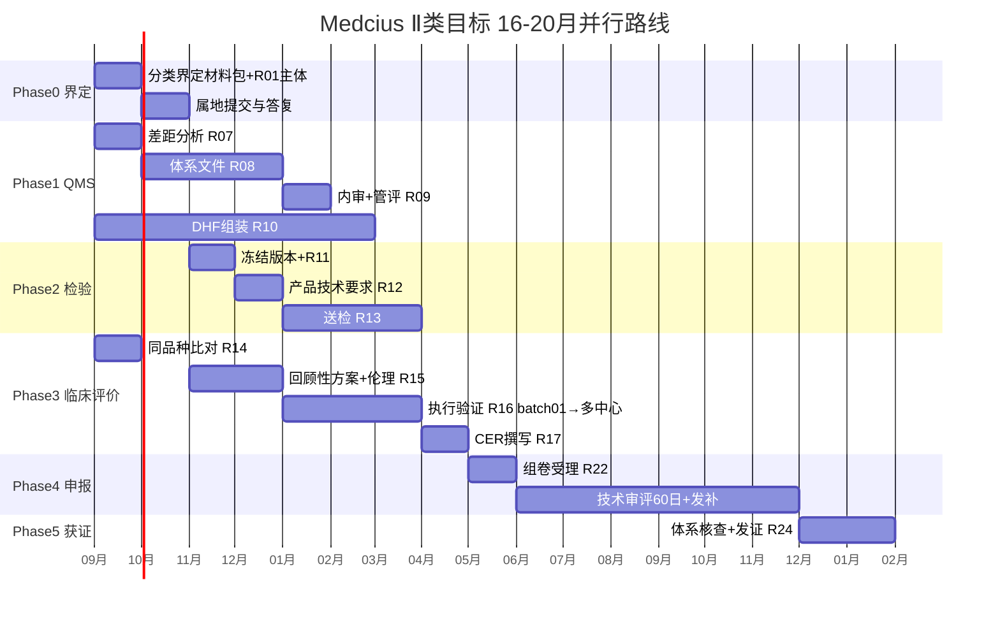

# 04 并行化时间线与费用区间（估算）

> 法定时限已核实（2021-47/104/121号），日历时间含检验/体系核查/发补等待，费用待询价。

## 1. 甘特（并行充分前提下）

- **关键路径**：R01主体（阻塞全部）→ R05界定答复（决定Ⅱ/Ⅲ）→ R15伦理（决定临床评价起点）→ R22受理
- **可并行**：R07-R10 与 R14 在 M0即启动；R11/R12 与 R15 并行
- **合计**：16-20月（Ⅱ类）；若Ⅲ类见 README 熔断分案，重排至 36-48月

## 2. 法定 vs 日历

| 环节 | 法定时限 | 日历估算 | 备注 |
|---|---|---|---|
| 二类技术审评 | 60日（市场监管总局令47号 §92） | 3-6月 | 含1-2轮发补，每轮补正后60日 |
| 三类技术审评 | 90日 | 6-12月 | 含临床试验核查 |
| 注册检验 | — | 2-4月 | 含网络安全检测 |
| QMS 体系核查 | — | 与审评并行 | 需提前完成内审管评 |

## 3. 费用区间（经验值，待询价核实）

| 项 | Ⅱ类估算 | Ⅲ类估算 |
|---|---|---|
| QMS咨询与认证 | 8-15万 | 15-30万 |
| 注册检验（含网安） | 5-10万 | 8-15万 |
| 临床评价（同品种+回顾性） | 5-10万 | 30-80万（含试验） |
| 法规顾问/代理 | 5-10万 | 10-20万 |
| **合计** | **~25-45万** | **~70-150万** |

> 医院侧 300份预测试成本：药师盲标工时约 2-3人周，可与 R16 复用。

## 4. 本周可并行的 3 件事（不等待界定答复）

1. **R01** 营业执照增项（1周可办）— 解锁 R05 提交资格
2. **R07** QMS 差距分析（对照 YY/T 0287 条款清单，用现有 DHF 五件套自评）
3. **batch01 真实化**：与 1 家合作医院签“回顾性研究”协议（数据不出院，去标识标准见 PRIVACY-SECURITY.md），启动 300 份处方脱敏与药师盲标
